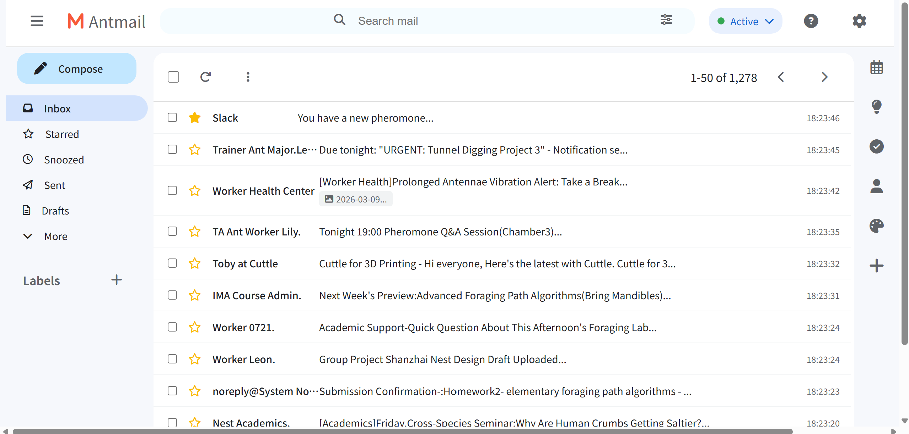
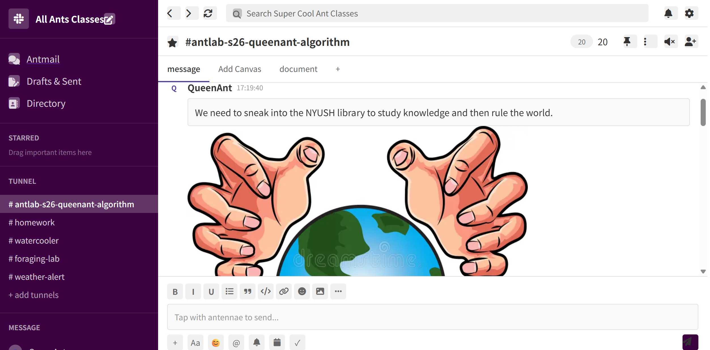
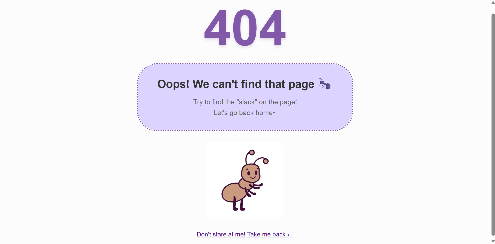

# Antmail&Slack: The Colony's Digital Hub

## A Tiny Empire of Inboxes and Tunnels
*Where NYUSH Library Ants Learn, Communicate, and Plot World Domination*

### About the Project
Antmail reimagines Gmail and Slack through the eyes of a colony of hyper-intelligent ants studying in the NYUSH library. Every email timestamp ticks in seconds (matching an ant's fleeting lifespan) and every message revolves around the tiny trials of ant academia. Click "hide" to watch the colony vanish into a grassy field or "fight" to summon a swarm that confuses any curious humans.

### Abstract
Born from a playful NYUSH library slogan warning against food spills ("ants will learn knowledge and rule the world"), Antmail is a whimsical reimagining of human communication tools for an ant colony. This project blurs the line between human and insect academia—mirroring NYUSH IMA students in Communication Lab, the ants attend classes, submit homework, and gossip about foraging routes. The distorted time scales (seconds instead of hours) and playful interaction mechanics (hide/fight buttons) highlight the absurdity of scaling human systems to tiny, ephemeral lives. It’s a lighthearted critique of digital communication culture while celebrating the quiet complexity of the natural world thriving alongside human learning spaces.

### Preview
| Image | Description |
|-------|-------------|
|  | The Antmail inbox features ant-specific emails about foraging labs and tunnel algorithms, with timestamps in seconds to match ant lifespans. |
|  | The ant-version of Slack (renamed "Tunnels") shows colony chat channels for weather alerts, homework, and watercooler gossip about human crumbs. |
|  | Also, because of the limited of links and button, there are some places that the users may want to click but turn out to find nothing, so I add this page to guide the users back to the right path. |

### Try It Yourself
[http://127.0.0.1:5500/shanzhaigmail/index.html](http://127.0.0.1:5500/shanzhaigmail/index.html)

---

## Reflections (For Course Documentation)
### 1 Process: Design & Composition
#### Reinterpreting Gmail and Slack
I began by deconstructing the core layouts of Gmail and Slack—focusing on their hierarchical structures (sidebar navigation, main content areas, top bars) and functional elements (search bars, message lists, channel directories). For Antmail, I retained Gmail’s three-column layout (sidebar, email list, right rail) but recontextualized every element:
- The Gmail logo became "Antmail" with a stylized ant-inspired "M"
- Email senders transformed into ant roles (QueenAnt, Worker Leon, TA Ant Xiao)
- Subject lines shifted from human concerns to ant priorities (foraging path algorithms, tunnel digging projects, pheromone Q&A sessions)
- Slack’s "channels" became "tunnels" and workspace names changed to "All Ants Classes"

For Slack’s redesign, I kept the left-sidebar channel navigation and message thread structure but modified the color scheme to deep purples and greens (evoking underground tunnels) while maintaining the familiar text input area and message formatting tools.

#### Gestalt Principles in Design
I used **proximity** to group related ant-specific content—clustering foraging lab emails together and separating weather alerts into their own Slack tunnel. **Similarity** guided consistent styling for ant roles (matching avatars and username colors for worker ants vs. queen ants) to create visual hierarchy that mirrors ant colony social structures. **Closure** played a key role in the hide/fight interactions: when users click "hide", the ant interface elements disappear and the brain fills in the grassy background as a complete "hiding spot", while "fight" triggers a swarm that visually completes the "defense" concept.

#### Interactive Elements as Narrative
Basic web interactions became storytelling tools:
- Scrolling through the email list mimics the endless hustle of ant colony activity—each new email represents another tiny task in the colony’s academic life
- Link clicks between Antmail and Slack create a seamless colony ecosystem, reinforcing the ants’ interconnected academic world
- The hide/fight buttons transform passive browsing into active participation in ant survival tactics, shifting the tone from "human productivity tool" to "tiny creature survival mechanism"

### 2 Process: Technical Implementation
#### HTML Structure
The project uses a modular HTML structure built around semantic container divs that mirror the original Gmail/Slack architecture but with ant-specific naming conventions:
- `.gmail-container` / `.slack-app` as root wrappers for each platform
- `.sidebar`, `.main-content`, and `.top-bar` for core layout sections (consistent with both original platforms)
- `.email-item` and `.message-group` for individual communication units
- Custom classes like `.ant-role` and `.tunnel-channel` to add ant-specific meaning to structural elements

Elements are grouped by function (navigation, content display, user input) to maintain maintainability while allowing for ant-themed modifications. IDs are used sparingly (only for critical interactive elements like the hide/fight buttons) while classes handle styling and structural grouping.

#### CSS Layout: Flexbox Implementation
Flexbox was the primary layout method for both Antmail and the ant-version of Slack, providing the flexibility to replicate the original platforms’ responsive structures while adapting to ant-themed content. A key implementation example is the Gmail-inspired layout:

```css
.gmail-app .main-content {
    display: flex;
    flex: 1;
    margin-top: 0;
}

.gmail-app .sidebar {
    min-width: 200px;
    max-width: 256px;
    background-color: rgb(246, 248, 252);
    padding: 8px 0;
    display: flex;
    flex-direction: column;
}

.gmail-app .email-list {
    flex: 1;
    background-color: rgb(255, 255, 255);
    border-radius: 16px;
    margin: 8px;
    overflow: hidden;
    display: flex;
    flex-direction: column;
    min-width: 0;
}

.gmail-app .right-sidebar {
    width: 48px;
    background-color: rgb(246, 248, 252);
    display: flex;
    flex-direction: column;
    align-items: center;
    padding: 8px 0;
    gap: 16px;
    flex-shrink: 0;
}


